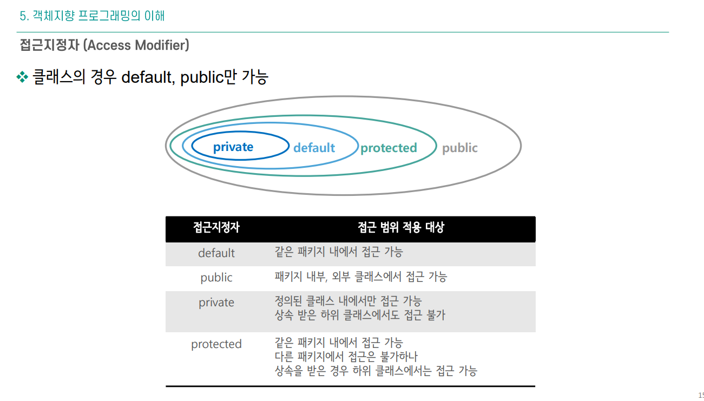

#  자바 (인테리제이 초반 설정)
---

인텔리제이 설정

### 플러그인(Plugins)

```

CheckStyle-IDEA
> JAVA로 하는 ESLINT 같은 느낌

>
setting에서 CheckStyle설정하기
naver checks를 다운 받아서 CheckStyle에서 +버튼으로 rule을 등록한다
그리고 같이 다운 받은 xml파일을 value에 파일명으로 넣어준다
https://github.com/naver/hackday-conventions-java/blob/master/rule-config/naver-checkstyle-rules.xml
https://github.com/naver/hackday-conventions-java/blob/master/rule-config/naver-checkstyle-suppressions.xml

>
Code style도 들어가서 java에서 설정할것 Scheme에서 받은 네이버 파일 열어서 쓰기
https://github.com/naver/hackday-conventions-java/blob/master/rule-config/naver-intellij-formatter.xml
다운받은파일
그리고 action들어가서 세이브 할때마다 프리티어 적용되게 설정하기
optimize imports 체크
Reformat code 체크

system settings들어가서 자동 저장 설정


Atom Material Icons
> 깔끔한 아이콘 보기

Key promoter X
> 

VSCode Keymap
>

Material Theme 
> 테마 설정가능


```


### 터미널에서 자바실행하는 방법

```shell
해당 자바파일이 있는 곳에서

javac 파일이름.java

하면 파일이름.class가 생긴다

여기서 이제

java 파일이름.java

하면 터미널에서 실행이 된다

```

```java
package com.hana.greetings;

import java.util.Scanner;

public class Hi {
	public static void main(String[] args) {

	scanTemp();
    >>메인에다가 이렇게 쓰고 알트+엔터로 크리에이트메소드로 뺀다! 
	}


    >>그러면 아래처럼 생긴다!
	private static void scanTemp() {

		Scanner scan = new Scanner(System.in);
		System.out.println();
	}
}

```

### 자바 args[]에 값을 넣고 실행하기

```
javac 이름.java

java 패키지.이름 args[]
으로arg[]값을 넣어서 실행가능

또는 인텔리제이의 윗창에서 

current file의 오른쪽에있는 ...(세로)를

눌러서 거기에 값을 넣고 실행을 해주면 된다

```


### 접근 제어자

```java

public - 모든 클래스에서 접근 가능
protected - 같은 패키지 또는 자식 클래스에서 접근 가능
private  - 같은 클래스 내에서만 접근 가능

```



### 제너릭 <T>

```java
public class Box<T> {
    private T item;

    public void setItem(T item) {
        this.item = item;
    }
}

```
자바의 제너릭(Generic)은 코드의 재사용성을 높이기 위해 특정 데이터 타입을 미리 정의하지 않고, 런타임에 사용할 수 있도록 만든 기능입니다. 제너릭을 사용하면 코드의 안정성을 높이면서 타입 변환을 줄일 수 있어 컴파일 시 오류를 줄일 수 있습니다.

여기서 <T>는 타입 파라미터를 의미하며, 다양한 타입을 하나의 클래스, 메서드, 인터페이스에서 사용할 수 있도록 합니다.

| 제너릭 안에서는 static으로 T를 선언하면 오류를

| 제너릭 에서 static T는 컴파일 오류가 뜬다. why? static 멤버는 클래스 로딩 시점에 메모리에 로드되기 때문에, 제네릭 타입 파라미터 T와 같이 인스턴스에 따라 달라지는 타입 정보를 가질 수 없습니다.


``` java
<? super T>: 하위 타입 한정 와일드카드 - 특정 타입 T와 그 상위 타입만 허용, 주로 데이터를 넣을 때 사용됨
<?>: 비한정 와일드카드 - 비한정 와일드카드로 모든 타입을 허용, 주로 읽기 전용으로 사용할 때 유용
<? extends T>: 상위 타입 한정 와일드카드 - 특정 타입 T와 그 하위 타입만 허용, 주로 데이터를 읽기 전용으로 사용할 때 사용됨

도 있다
```


### StringBuffer

자바에서 문자열을 효율적으로 수정할 수 있도록 만들어진 클래스입니다. String은 불변(immutable) 클래스라서 한 번 생성되면 내용이 바뀌지 않지만, StringBuffer는 가변(mutable) 클래스이기 때문에 문자열을 수정, 추가, 삭제하는 작업에 유리합니다.

```java
주요 메서드
append(): 문자열을 뒤에 추가
insert(): 특정 위치에 문자열 삽입
delete(): 특정 범위의 문자열 삭제
reverse(): 문자열을 뒤집음
toString(): StringBuffer 객체를 String으로 변환
```


```javapublic class Main {
    public static void main(String[] args) {
        StringBuffer sb = new StringBuffer("Hello");

        sb.append(" World"); // "Hello World"로 수정
        System.out.println(sb); // 출력: Hello World

        sb.insert(6, "Java "); // "Hello Java World"로 수정
        System.out.println(sb); // 출력: Hello Java World

        sb.delete(6, 11); // "Hello World"로 수정
        System.out.println(sb); // 출력: Hello World

        sb.reverse(); // "dlroW olleH"로 수정
        System.out.println(sb); // 출력: dlroW olleH
    }
}

```	