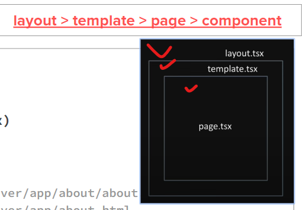

### NEXT
https://nextjs.org/learn

> NEXT 14를 사용하자

리액트 베이스의 풀스택이다!

### 폴더가 라우터다


(폴더이름)내 맘대로 만들고
그안에 들어가는 구성요소는 page, layout, template 이름 고정이다 
ex) about 폴더
```
1. mkdir app/about  (Route Folder)
2. make app/about/layout.tsx 
3. make app/about/page.tsx
4. nav to page from Home(app/page.tsx) 
```

### 서버에서 이루어진다.

> 위쪽에 'use client'를 해주어야지 클라이언트에서 만들어준것이다.


### 프리티어(위에 임포트 순서 설정)

```
.prettierrc

{
  "singleQuote": true,
  "jsxSingleQuote": true,
  "semi": true,
  "trailingComma": "es5",
  "plugins": ["@trivago/prettier-plugin-sort-imports"],
  "importOrder": [
    "^next$",
    "^next/\\w*$",
    "^next/(.*)$",
    "^react$",
    "^react/(.*)$",
    "^@/lib/(.*)$",
    "^[./]"
  ]
}

>에서 importOrder의 내부 순서를 바꾸어주면 import되는것들의 순서를 지정해줄 수 있다.

```


### yarn dev
### yarn build -> yarn start

> 차이를 알아두기(dev에서는 계속 시간같은거 업데이트 가능하지만, start에서는 배포용이라서 딱 그 시점?이 올라감, 따라서 다이나믹하게 만들어줘야함)


### useRouter (only Client Component)

```js
'use client'; > 이거는 이제 클라이언트(=브라우저)에서 실행이 되게끔한다!!!
//클라이언트 컴포넌트에서는 어싱크(async)를 못 쓴다.


// useRouter
import { useRouter } from 'next/navigation'
const router = useRouter()
router.push('/dashboard', { scroll: false });

// another functions
router.back();
```


### useSearchParam 


??


### 다이나믹하게 페이지

```js
// /hi/[time]/page.tsx                            
export default function HiTime({ params }: { params: { time: string } }) {
  return <div>Good {params.time}!</div>
}

```