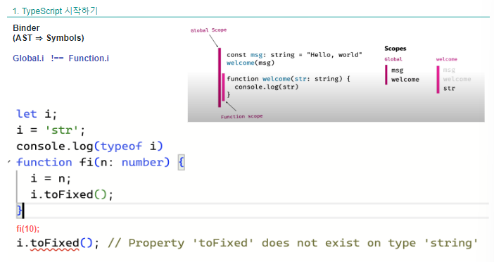

# 타입스크립트?
---

### 타입스크립트의 구성 4가지
1. 프로그래밍 언어: 새로운 구문이 포함된 언어
2. 타입 검사기(TypeChecker): 코드의 모든 구성요소(함수,변수 등)를 이해하고 오류 감별 
3. 컴파일러(Pre-Compiler): TS Syntax-tree를 JS Code로 생성 (cf. AltJS) 
    * Pre 는 선처리가 된다는 말
4. 언어지원 서비스(IDE): VSCode, SublimeText, Vim 등의 편집기에서 TS 지원

---

#
    타입스크립트 연습하는 사이트
    https://www.typescriptlang.org/play/
    Settings의 AST를 check하고, 버전을 v5.1.6으로 하여 AST를 확인하자

---

타입스크립트는
전역의 i와 함수의 i는 서로 다른 심볼로 같은 변수라도 스코프에 따라서 에러가 날 수도 있고 안날 수도 있다.

---

